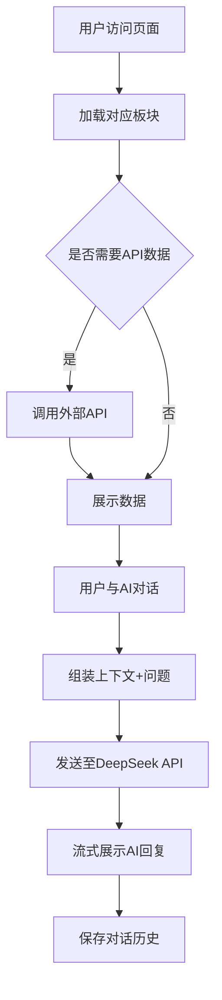

# 综合学习智能体 - 产品需求文档

## 1. 产品概述

综合学习智能体是一款集成多领域学习资源的智能Web应用，整合英语词汇、驾考练习、历史知识四大板块，并为每个板块配备AI对话助手。产品旨在为用户提供一站式学习体验，通过智能化交互提升学习效率。

- 目标用户：学生、考证人群、终身学习者
- 核心价值：聚合学习资源 + AI智能答疑 + 上下文关联学习

## 2. 核心功能

### 2.1 功能模块

1. **每日英语板块**
   - 调用随机英语单词API，展示每日学习内容
   - 展示单词、音标、释义、例句
   - 支持刷新获取新单词
   - AI对话助手可围绕当前单词进行深度讲解

2. **英语单词详解板块**
   - 提供搜索框，用户输入单词查询
   - 调用单词详解API，展示完整词义、词性、用法
   - AI对话助手可针对该单词进行扩展提问

3. **随机驾考题目板块**
   - 调用驾考题库API，展示科目一/四随机题目
   - 支持选项选择、答案判定、解析展示
   - AI对话助手可解释交规原理、易错点分析

4. **历史上的今天板块**
   - 调用历史事件API，展示当天发生的重要事件
   - 时间轴布局，事件卡片展示
   - AI对话助手可深入解读历史背景、人物影响

### 2.2 AI对话功能（每个板块独立）

- 每个板块右下角悬浮AI对话按钮
- 点击展开对话面板，支持展开/收起
- AI基于当前板块上下文内容进行回答
- 对话历史记录保存在localStorage，支持查看历史问答
- 集成DeepSeek大模型作为对话后端
- 支持清空对话、重新生成等操作

### 2.3 全局功能

- 左侧导航栏切换四个板块
- 页面顶部显示当前板块标题和简介
- 加载状态提示、错误重试机制
- 响应式布局，支持移动端适配

## 3. 核心流程

### 3.1 用户使用流程

用户打开应用 → 默认展示每日英语板块 → 浏览单词内容 → 点击AI助手提问 → 查看对话历史 → 切换至其他板块 → 继续使用对应功能和AI助手

### 3.2 数据流

## 4. 用户界面设计

### 4.1 设计风格

- **整体风格**：现代学术杂志风，温暖、专注、有质感
- **主色调**：
  - 背景：暖象牙色 `#FAF8F5`
  - 主色：深墨蓝 `#1E3A5F`
  - 强调色：琥珀金 `#D4A574`
  - 文字：深炭灰 `#2D2D2D`
  - 次要文字：中灰 `#6B6B6B`
- **字体**：
  - 标题：'Noto Serif SC', Georgia, serif（优雅衬线体）
  - 正文：'LXGW WenKai', 'PingFang SC', sans-serif（清晰易读）
- **按钮样式**：圆角矩形（8px），悬停时有轻微上浮阴影
- **布局**：左侧固定导航（200px），右侧主内容区，AI对话为右侧边栏（350px可收起）
- **图标**：使用 Lucide React 图标库，线性风格

### 4.2 页面设计概览

| 页面/区域 | 模块 | UI元素 |
|-----------|------|--------|
| 左侧导航 | 板块切换 | 图标+文字，当前项高亮，hover有背景色变化 |
| 顶部栏 | 标题+简介 | 板块标题大字，下方一行简介文字 |
| 内容区 | 数据展示 | 卡片式布局，圆角12px，白色背景，细微阴影 |
| AI对话 | 对话面板 | 消息气泡区分用户/AI，输入框固定在底部 |
| 历史记录 | 侧边抽屉 | 按时间倒序排列，可点击回顾 |

### 4.3 交互动效

- 页面切换：淡入淡出（200ms）
- 卡片加载：错开出现（stagger 50ms）
- AI消息：打字机效果流式输出
- 按钮悬停：上移2px + 阴影加深
- 导航切换：指示器平滑滑动

### 4.4 响应式设计

- 桌面端：左侧导航固定，右侧内容+AI侧边栏并排
- 平板端：左侧导航收缩为图标模式，AI侧边栏变为底部浮层
- 移动端：顶部标签栏切换板块，AI对话全屏浮层

## 5. 技术要点

- API调用需处理跨域问题（使用代理或CORS）
- DeepSeek API需后端代理保护密钥
- 对话历史使用localStorage持久化，按板块隔离存储
- 流式响应处理SSE格式
- 错误边界处理API失败情况
