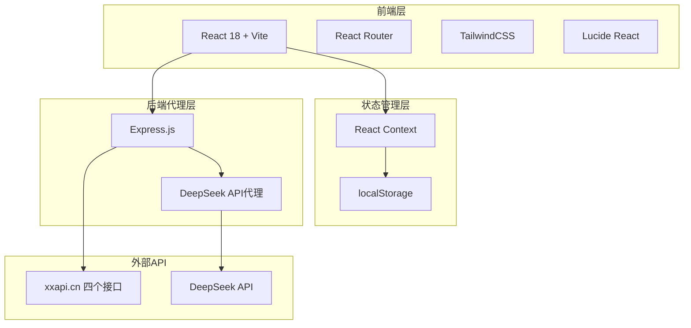

# 综合学习智能体 - 技术架构文档

## 1. 架构设计



## 2. 技术选型

- **前端框架**：React 18 + TypeScript
- **构建工具**：Vite 5
- **样式方案**：TailwindCSS 3
- **路由**：React Router DOM 6
- **图标**：Lucide React
- **字体**：Noto Serif SC（标题）、LXGW WenKai（正文）
- **后端代理**：Express.js 4（仅用于代理DeepSeek API请求）
- **HTTP客户端**：原生fetch（前端）、axios（后端代理可选）

## 3. 项目结构

```
ClearLearn/
├── .trae/documents/
│   ├── PRD.md
│   └── Technical-Architecture.md
├── server/                    # Express代理服务
│   ├── index.js
│   └── package.json
├── src/
│   ├── components/            # 公共组件
│   │   ├── Layout.tsx         # 整体布局
│   │   ├── Sidebar.tsx        # 左侧导航
│   │   ├── ChatPanel.tsx      # AI对话面板
│   │   ├── ChatMessage.tsx    # 单条消息
│   │   ├── LoadingCard.tsx    # 加载骨架屏
│   │   └── ErrorFallback.tsx  # 错误边界
│   ├── pages/                 # 页面/板块
│   │   ├── DailyEnglish.tsx   # 每日英语
│   │   ├── WordDetail.tsx     # 单词详解
│   │   ├── DrivingTest.tsx    # 驾考题目
│   │   └── TodayInHistory.tsx # 历史上的今天
│   ├── hooks/                 # 自定义Hooks
│   │   ├── useApi.ts          # API请求封装
│   │   ├── useChat.ts         # AI对话逻辑
│   │   └── useLocalStorage.ts # localStorage封装
│   ├── context/
│   │   └── ChatContext.tsx    # 对话状态管理
│   ├── types/
│   │   └── index.ts           # TypeScript类型定义
│   ├── utils/
│   │   └── helpers.ts         # 工具函数
│   ├── App.tsx
│   ├── main.tsx
│   └── index.css
├── index.html
├── package.json
├── vite.config.ts
├── tailwind.config.js
└── tsconfig.json
```

## 4. 路由定义

| 路由 | 用途 | 说明 |
|------|------|------|
| / | 默认重定向 | 跳转至 /daily-english |
| /daily-english | 每日英语板块 | 展示随机单词 |
| /word-detail | 英语单词详解 | 搜索并展示单词详情 |
| /driving-test | 驾考题目板块 | 随机驾考题 |
| /today-history | 历史上的今天 | 当天历史事件 |

## 5. API接口定义

### 5.1 外部学习API（前端直接调用）

| 接口 | 方法 | 用途 | 响应格式 |
|------|------|------|----------|
| https://v2.xxapi.cn/api/randomenglishwords | GET | 随机英语单词 | { code, data: { word, phonetic, meaning, example } } |
| https://v2.xxapi.cn/api/englishwords?word={word} | GET | 单词详解 | { code, data: { word, phonetic, meanings[], examples[] } } |
| https://v2.xxapi.cn/api/jiakao?subject=1 | GET | 驾考题目 | { code, data: { question, options[], answer, explanation } } |
| https://v2.xxapi.cn/api/history | GET | 历史事件 | { code, data: [{ date, title, description }] } |

### 5.2 AI对话API（后端代理）

**请求**：POST /api/chat
```typescript
interface ChatRequest {
  messages: Array<{
    role: 'system' | 'user' | 'assistant';
    content: string;
  }>;
  stream?: boolean;
}
```

**响应**：SSE流式 或 JSON
```typescript
interface ChatResponse {
  choices: Array<{
    message: {
      content: string;
    };
  }>;
}
```

## 6. 数据模型

### 6.1 对话消息

```typescript
interface ChatMessage {
  id: string;           // 唯一标识
  role: 'user' | 'assistant';
  content: string;
  timestamp: number;
  section: string;      // 所属板块
}
```

### 6.2 对话历史存储结构

```typescript
interface ChatHistory {
  [section: string]: ChatMessage[];
}
```

localStorage键名：`clearlearn_chat_history`

### 6.3 板块上下文

```typescript
interface SectionContext {
  section: string;
  title: string;
  currentData: any;     // 当前展示的API数据
}
```

## 7. DeepSeek代理服务

Express服务仅做一件事：接收前端对话请求，添加Authorization头后转发至DeepSeek API，并将SSE流返回给前端。

环境变量：
- `DEEPSEEK_API_KEY`：DeepSeek API密钥
- `PORT`：服务端口，默认3001

## 8. 开发与运行

### 开发模式
```bash
# 终端1：启动前端
npm run dev

# 终端2：启动代理服务
cd server && node index.js
```

### 构建
```bash
npm run build
```
